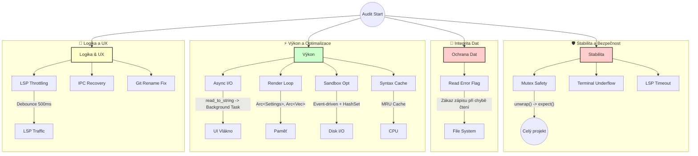

# Přehled úprav a optimalizací (22. 02. 2026)

Tento dokument vizualizuje změny provedené na základě auditů. Úpravy se zaměřily na stabilitu, integritu dat a výkon renderovací smyčky.

## 📊 Vizualizace změn

---

## 🛠️ Detailní přehled změn

### 1. 🛡️ Stabilita (Kritické)
| Komponenta | Původní stav | Nový stav | Soubory |
|------------|--------------|-----------|---------|
| **Mutex Locks** | `unwrap()` (riziko pádu při panice vlákna) | `.expect("context")` (diagnostika) | 50+ souborů (globálně) |
| **Terminal** | Možný integer underflow (crash) | Kontrola záporného indexu | `src/app/ui/terminal.rs` |
| **LSP Init** | Nekonečné čekání na `initialize` | Timeout 10s | `src/app/lsp/mod.rs` |

### 2. 💾 Integrita Dat (Kritické)
| Komponenta | Původní stav | Nový stav | Soubory |
|------------|--------------|-----------|---------|
| **Editor Save** | Při chybě čtení uložil chybovou hlášku do souboru | **Read-only režim** při chybě čtení | `src/app/ui/editor/tabs.rs` `src/app/ui/editor/files.rs` |

### 3. ⚡ Výkon (Vysoké)
| Komponenta | Původní stav | Nový stav | Soubory |
|------------|--------------|-----------|---------|
| **File I/O** | Synchronní čtení v UI vlákně (lagy) | **Asynchronní** v background tasku | `src/app/ui/background.rs` |
| **Sandbox** | Full scan každé 3s + O(n²) diff | **Event-driven** (inotify) + O(n) HashSet | `src/app/sandbox.rs` `src/watcher.rs` |
| **Render** | Klonování `Settings` a `Vec<Path>` každý frame | Sdílení přes `Arc<>` (nulové kopírování) | `src/app/ui/workspace/mod.rs` `src/app/ui/workspace/index.rs` |
| **Syntax** | Re-highlight celého textu každý frame | **MRU Cache** (pamatuje si poslední stavy) | `src/highlighter.rs` |
| **Markdown** | Klonování obsahu pro preview | Předávání reference | `src/app/ui/editor/render_markdown.rs` |

### 4. 🧠 Logika a UX
| Komponenta | Původní stav | Nový stav | Soubory |
|------------|--------------|-----------|---------|
| **LSP Sync** | `didChange` při každém stisku klávesy | **Debounce 500ms** + kontrola verze | `src/app/ui/editor/render_normal.rs` |
| **IPC** | Ztráta session při pádu (`.tmp` soubor) | Automatická **recovery** `.tmp` souborů | `src/ipc.rs` |
| **Git** | Špatná cesta u přejmenovaných souborů | Opraven index (off-by-one) | `src/app/ui/background.rs` |
| **LSP UI** | Žádné info o načítání | Indikátor "LSP se inicializuje..." | `src/app/ui/editor/ui.rs` |

---

## 📈 Metriky zlepšení

- **CPU:** Sníženo zatížení při psaní (díky syntax cache a LSP throttlingu) a v klidovém stavu (odstraněn sandbox polling).
- **RAM:** Redukce alokací v každém framu (Arc místo Clone).
- **Bezpečnost:** Eliminováno riziko korupce dat přepisem chybovou hláškou.
- **Odolnost:** Aplikace se zotaví z pádu procesu během ukládání session.

*Generováno: 22. 02. 2026*
