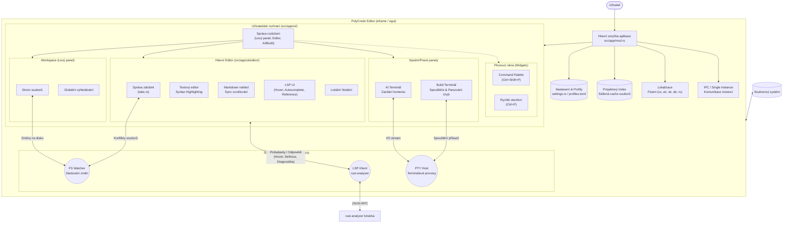

# Architektura PolyCredo Editoru (Stav k 21. 2. 2026)

Tento dokument poskytuje vysokoúrovňový přehled architektury a datových toků v rámci PolyCredo Editoru. Aplikace je napsána v jazyce Rust a využívá framework `eframe`/`egui` pro okamžité (immediate-mode) vykreslování uživatelského rozhraní.

## Blokový diagram (Mermaid)

## Popis jednotlivých modulů

### 1. Jádro aplikace (`AppCore`, `Settings`, `I18n`)
- **AppCore (`src/app/mod.rs`):** Srdce aplikace, které se stará o hlavní smyčku `egui`. Udržuje celkový stav okna, rozložení panelů a zpracovává globální klávesové zkratky.
- **Index (`ProjectIndex`):** Asynchronní systém pro skenování souborů v projektu. Agreguje cesty pro rychlé vyhledávání (Ctrl+P) a globální hledání textu, čímž šetří I/O operace.
- **Nastavení (`settings.rs`, `config.rs`):** Čte a zapisuje `.polycredo/profiles.toml` a globální `settings.toml`. Stará se o aplikaci témat (dark/light) a uživatelské předvolby.
- **Lokalizace (`i18n.rs`):** Pomocí knihovny Fluent se stará o to, aby veškerý text v aplikaci byl přeložen bez hardcodování řetězců ve zdrojovém kódu.

### 2. Uživatelské rozhraní (`UI`)
Uživatelské rozhraní je postavené na komponentním přístupu:
- **Workspace (Levý panel):** Obsahuje adresářový strom pro navigaci v projektu a globální vyhledávání. Zajišťuje CRUD operace nad soubory.
- **Hlavní Editor (`src/app/ui/editor/`):** Zdaleka nejsložitější část, nedávno rozdělená na menší logické bloky. 
  - Řeší vykreslování textu se zvýrazněním syntaxe (`highlighter.rs`).
  - Podporuje rozdělený pohled (split-view) pro okamžitý náhled Markdown souborů.
  - Vykresluje plovoucí prvky z LSP (LSP UI) – jako je auto-doplňování, bubliny s dokumentací nebo okno pro hledání referencí.
  - Upozorňuje uživatele, pokud byl soubor změněn jiným programem na disku.
- **AI a Build panely:** Jsou to oddělené emulátory terminálu (`egui_term` nad `portable-pty`). AI terminál je schopen vnímat "kontext" editoru (načte otevřené soubory a chyby z kompilace) a umí fungovat v odděleném systémovém okně (viewportu).
- **Plovoucí widgety:** `Command Palette` (příkazová řádka editoru) a Rychlé otevírání souborů. Vznáší se nad zbytkem UI.

### 3. Služby na pozadí (Asynchronní `Tokio` Runtime)
Egui je synchronní framework, který vykresluje snímky 60x za vteřinu. Těžké operace se musí dít na pozadí:
- **LSP Klient (`src/app/lsp/`):** Přes kanály (MPSC) a Tokio runtime komunikuje s běžícím procesem `rust-analyzer` pomocí protokolu JSON-RPC. Editor si od něj žádá informace (kde je definice, jaké jsou chyby v kódu) a klient mu asynchronně odpovídá do hlavní smyčky, která následně aktualizuje UI (zobrazí červené vlnovky nebo našeptávač).
- **FS Watcher (`src/watcher.rs`):** Poslouchá změny na pevném disku. Když je soubor změněn zvenčí (např. pomocí `git pull`), upozorní editor, aby načetl novou verzi, nebo vyvolal dialog o konfliktu, pokud měl uživatel neuložené změny.
- **PTY Host:** Nízkoúrovňová vrstva pro komunikaci s pseudoterminály. Zajišťuje běh nástrojů jako bash, cargo nebo AI agentů.

## Datové toky
1. **Editace:** Uživatel píše kód -> TextEdit aktualizuje svůj stav -> Při pauze odešle LSP Klient asynchronní zprávu `didChange` serveru -> Server analyzuje kód -> Opožděně vrátí diagnostiku (chyby) -> Editor vykreslí chyby (vlnovky a ikony ve status baru).
2. **AI Interakce:** Uživatel stiskne "Sync" -> Editor zkopíruje cesty aktuálně otevřených záložek a seznam chyb z kompilace (BuildTerm) -> Ošle to formou textového příkazu přes PTY do AI Terminálu -> LLM agent má aktuální přehled o problému.
3. **Změny souborů:** FS Watcher zaregistruje změnu souboru v projektu -> Aktualizuje sdílený Project Index -> UI ihned promítne nové soubory do stromu a nabídky Ctrl+P.
